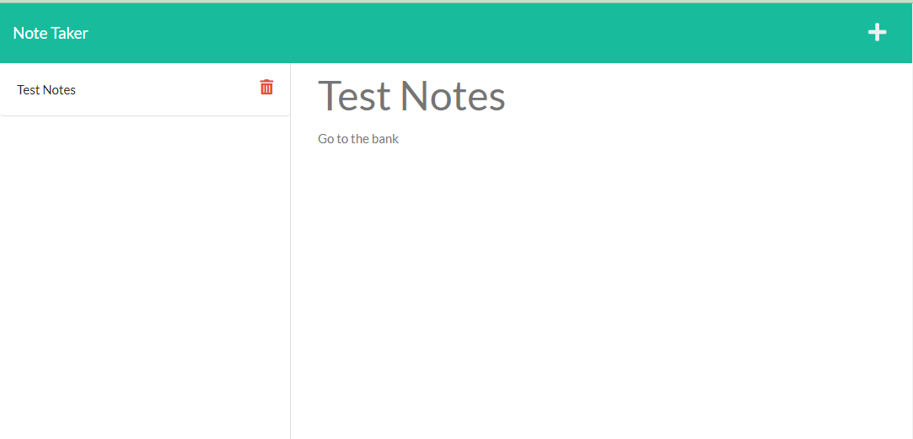

# **Note Taker**

## **Description**

This is a back-end project mainly involving express. We were given a starter code and needed to make the back-end work in order for the project to have any functionality. This was a fun project and a useful one that I will probably use myself in the future. This is the first project with a perptual "server" and using Heroku for deployment. 

One of the requirements was to have a unique ID generate for each note. I utilized an npm package called "shortid" for this. The repo for that can be found here: [shortid](https://www.npmjs.com/package/shortid)

There was also a "bonus" to make the delete functionality work. This is working in my project and the .js file is notated with how this works.

Deployed Application: [Note Taker App](https://gentle-springs-55610.herokuapp.com/)

---

## **Table of Contents**

* [Screenshot](#screenshot)

* [Installation](#installation)

* [Usage](#usage)

* [License](#license)

* [Contributing](#contributing)

* [Questions](#questions)

---

## **Screenshot**



Deployed Application: [Note Taker App](https://gentle-springs-55610.herokuapp.com/)

---

## **Installation**

To install the needed dependencies, run the following commands:

```
npm i 
```

---

## **Usage**

This project can be used to take notes and store todo items in a clean and easy to use format. To run this project locally, start the express server with the following command:

```
npm start
```

Deployed Application: [Note Taker App](https://gentle-springs-55610.herokuapp.com/)

---

## **License**

This project is using no license.

---

## **Contributing**

Contributions can be made as issues to the repo or by emailing me directly.

---

## **Questions**

If you have any questions about the project or repo, contact me directly at justincodingclass@gmail.com or open an issue on the repo. You can find my github profile with this project and others at [github.com/jwatkins28](https://github.com/jwatkins28/)
